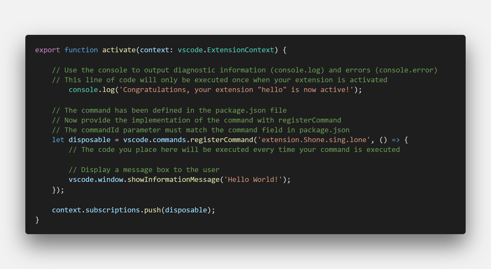

# 搞个小玩意儿 make a toy

- [Extension Anatomy](https://code.visualstudio.com/api/get-started/extension-anatomy)
- [中文辅导理解](https://www.cnblogs.com/caipeiyu/p/5507252.html)

basic and important 
in package.json  that

```js
	"activationEvents": [
        "onCommand:extension.Shone.sing.lone"//监听commoand 如果是extension.Shone.sing.lone
	],
	"main": "./out/extension.js",
	"contributes": {
		"commands": [{
			"command": "extension.Shone.sing.lone",// 触发command
			"title": "Shone"//panel 控制面板输入
		}]
    },
    ...
    /* 注册，可以理解为[【事件】 =>callback function]调用各种API */
let disposable = vscode.commands.registerCommand('extension.Shone.sing.lone',function(){})

```

- [extension-capabilities overview](https://code.visualstudio.com/api/extension-capabilities/overview):
  - extension,能干嘛
  - 主要分类
  - 核心功能

---

